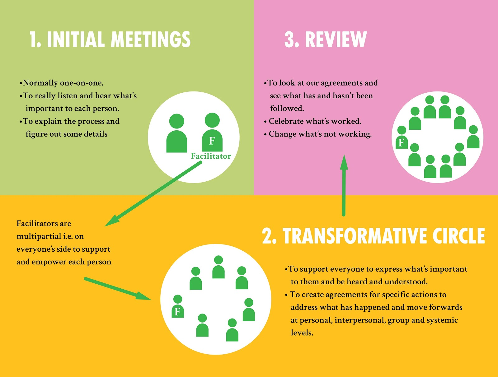

# Tranformative Conflict Path

We have a group of trained conflict facilitators ready to help teams dealing with difficult situations by taking them through the **Transformative Conflict Path**.

This involves 3 steps:

### **1. Initial Meetings**

* Normally conducted one-on-one with the facilitator.
* To really listen and hear what is important to each person.
* To explain the process and figure out any details.
* To make sure everyone who needs to be at the TCJ circle is included.
* The very first and initial meetings often take between 40 min to 1.5 hours.
* Some processes might necessitate only one in person meeting, while certain will need several.

### 2. **Transformative Conflict Circle**

* To support everyone to express what’s important to them and be heard and understood.
* To create agreements for specific actions to address what has happened and move forwards at personal, interpersonal and systemic levels \(Though these will often fall outside of the Conflict Team’s mandate\). Agreements must have clear specific action steps with name's on them, and be time specific.
* After and if agreements have been made, a review in person or on Zoom could happen around 1 month after the TCJ Circle.

### 3. Review

* To look at our agreements and 
  * see what has and
  * hasn’t been followed 
  * celebrate what’s worked and 
  * change what’s not working

