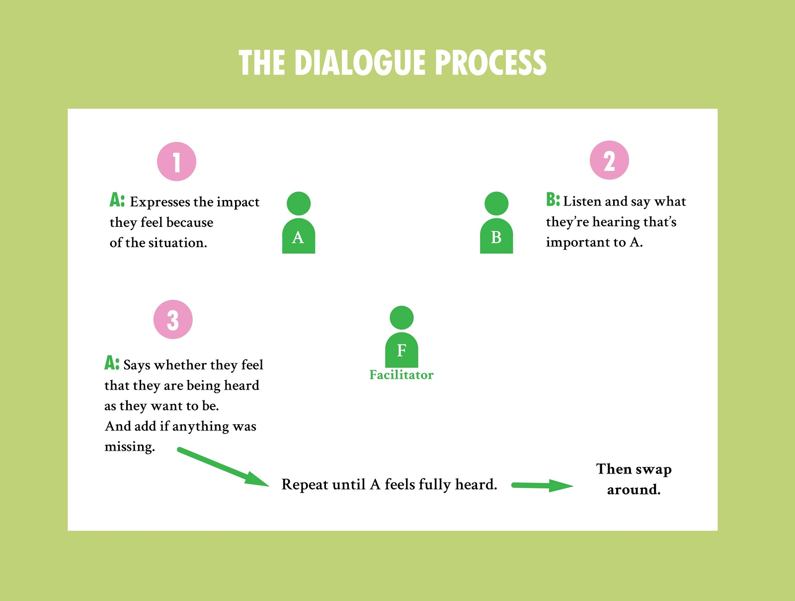

# Dialogue Process

The Transformative Conflict Circle will follow a **Dialogue Process** which is a method of allowing everyone in a conflict to express how the situation has affected them and feel heard by the other parties. 

It does this by giving one person the ‘**microphone**’ which gives them the space to say what they need without interruption,whilst the other has the ‘**headphones**’, in order to focus on listening and then reflect back what they are hearing is important to the other person. 

When one person feels heard, the participants then swap over so everyone has a chance to speak and be heard.

**The process is designed to help people hear, understand and take in how people are feeling, and what really matters to them, in a way that supports empathy and care.**

