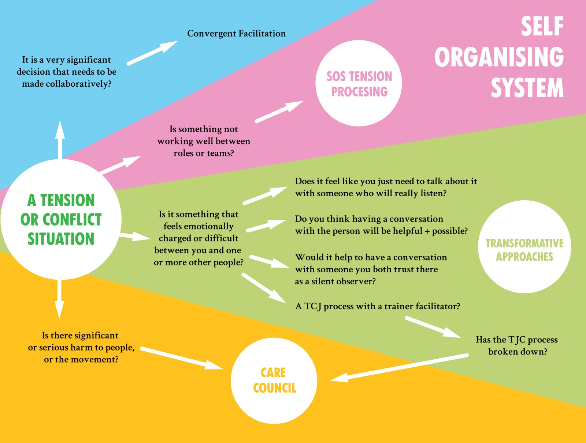

# Which Situations?

We want everyone to know where to go to engage with conflict/tension, and how to find support to do that easily and quickly.

This flowchart is to help you navigate what to do when you experience conflict or tension \(whether you're in the centre of it, or just affected by it\). Some situations will require support from people in the TCJ team whilst others will fall under the SOS or Care Council teams.

